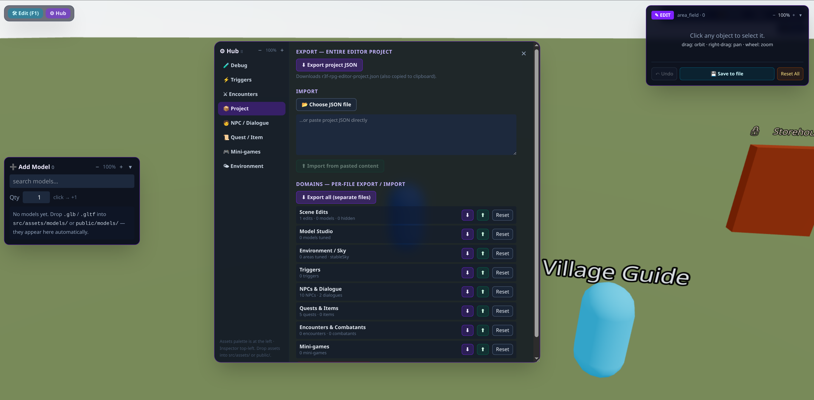

# React Three Fiber RPG Builder

A powerful, reusable **RPG world-builder kit** built with React Three Fiber, Rapier physics, and Zustand. This toolkit was designed to streamline the creation of 3D RPG environments by providing an intuitive **Edit Mode** and an **auto-discovery asset system**.



## 🚀 Key Features

*   **Auto-Discovery Asset System**: Drop `.glb` models or textures into `src/assets/`, and they are automatically detected and available in the editor via `import.meta.glob`.
*   **Integrated World Editor**: Toggle **Edit Mode (F1)** to place props, sculpt terrain, and dress your world with real-time gizmos.
*   **Advanced Terrain System**: 
    *   Heightfield sculpting with multiple brush tools.
    *   Multi-material splatting (auto-blending by height/slope + manual painting).
    *   Placeable PBR patches that drape over terrain.
    *   Dynamic water and terrain LOD.
*   **RPG Systems Core**:
    *   **Dialogue System**: Tree-based dialogues with conditions and effects.
    *   **Quest System**: Track progress and handle rewards via a flexible seam.
    *   **Interaction System**: Handle NPCs, items, doors, and area transitions.
*   **Dynamic Environment**: 
    *   Real-time day/night cycle and weather system.
    *   Biome-based atmosphere (lighting, fog, particles).
*   **Performance Ready**: Built on React 19 and Vite 6 for lightning-fast HMR and optimized production builds.

## 🛠 Tech Stack

*   **Core**: [React 19](https://react.dev/), [Vite 6](https://vitejs.dev/)
*   **3D Engine**: [Three.js](https://threejs.org/), [@react-three/fiber](https://github.com/pmndrs/react-three-fiber)
*   **Physics**: [@react-three/rapier](https://github.com/pmndrs/react-three-rapier)
*   **State Management**: [Zustand](https://github.com/pmndrs/zustand)
*   **Styling**: [Tailwind CSS v4](https://tailwindcss.com/)
*   **Icons**: [Lucide React](https://lucide.dev/)

## 🏁 Quick Start

### Installation
```bash
npm install
```

### Development
```bash
npm run dev
```
Open [http://localhost:5173](http://localhost:5173) in your browser.

### Build
```bash
npm run build
```

## 🎮 Controls

### Play Mode
*   **WASD**: Move
*   **Space**: Jump
*   **E**: Interact (Talk to NPCs, open doors, pick up items)
*   **F1**: Toggle Edit Mode

### Edit Mode
*   **Click**: Select object
*   **W / E / R**: Move / Rotate / Scale gizmos
*   **Shift + D**: Duplicate selection
*   **Del**: Delete selection
*   **Esc**: Deselect
*   **Ctrl + Z / Y**: Undo / Redo

## 📁 Folder Structure

*   `src/assets/`: Drop-in location for models, textures, and materials.
*   `src/data/`: Seed data for areas, NPCs, quests, and dialogues.
*   `src/game/`: Core R3F components (Scene, Player, Terrain, Interaction).
*   `src/stores/`: Zustand state management for all game systems.
*   `src/ui/`: React-based HUD and Editor panels.

## 📜 License

This project is private. (Update this section as needed)

---
*Created with ❤️ for R3F developers.*
